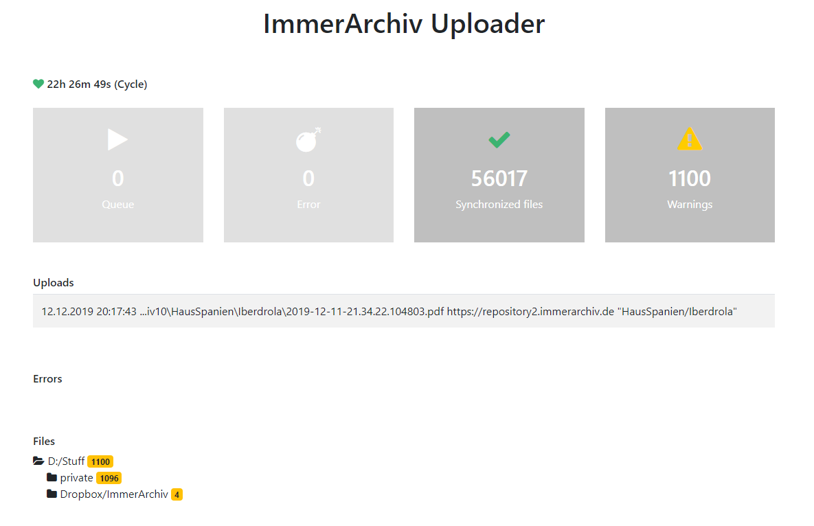

# ImmerArchiv.UploadService
Is a servce for uploading files to repositories for long-term preservation. For more Information see https://immerarchiv.de



# Features
- 5 minute setup (onyl one small config file)
- upload files files fully automatically into the configured repositories
- web interface for status view
- file system watcher to detect new files in configured directories

## get started
0. Providing the repositories (see [PHPRepository auf Linux-Server installieren](https://immerarchiv.de/2016/10/14/phprepository-auf-linux-server-installieren/))
1. Configure Service config.yml
2. Start Service

### Configure config.yml
```
---
#Port nummber for UserInterface use Browser on localhost:8888
server:
  port: 8888    79031160-2d6f-4118-a0b2-e898a0ab0071
repositories:
- url: "http://repository.domain.org:8881"
  name: "username"
  token: "9ead2ea5-0703-47f4-b163-6528e701ad40"
pathes:
- path: "D:/Stuff/Archiv1"
ignore: ["Thumbs.db"]
```
### Start service
```
java -jar UploadService-1.0.0-jar-with-dependencies.jar
```
### Automate on Windows
create runnable jar and run it with jawis https://github.com/dfriedenberger/jawis

### Status page
See http://localhost:8888


## Test with Repository
 
Test upload service with repositories. You can download PHPRepository from https://immerarchiv.de/software-download/
Otherwise you can use docker. 

### Create Docker Image
```
cd src/test/resources/docker
docker build -t immerarchiv.repository .
```

### Start Repository n-times
#### First repository
```
docker run -it --rm -p 8881:80 -h repository1.example.org immerarchiv.repository:latest 
```
Initialize in Browser http://localhost:8881/

#### Second repository
```
docker run -it --rm -p 8882:80 -h repository2.example.org immerarchiv.repository:latest 
```
Initialize in Browser http://localhost:8881/

and so on ...

#### Start docker with bash (for start and stop apache)
```
docker run -it --rm -p 8881:80 -h test.immerarchiv.com immerarchiv.repository:latest bash 
> apache2ctl start
```


# Contact
Dirk Friedenberger, Waldaschaff, Germany

Write me (oder Schreibe mir) (o Escríbeme)
projekte@frittenburger.de

http://www.frittenburger.de 